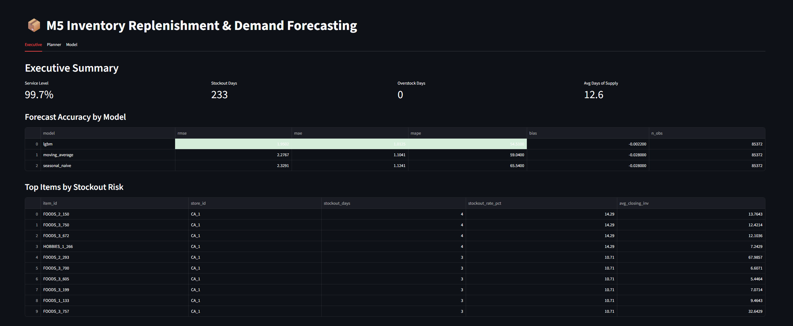
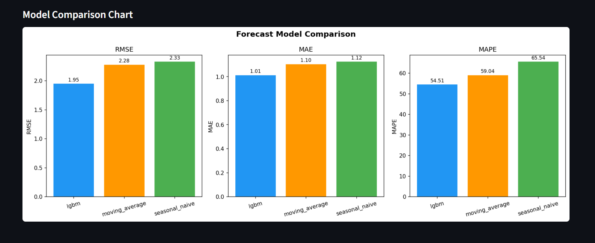
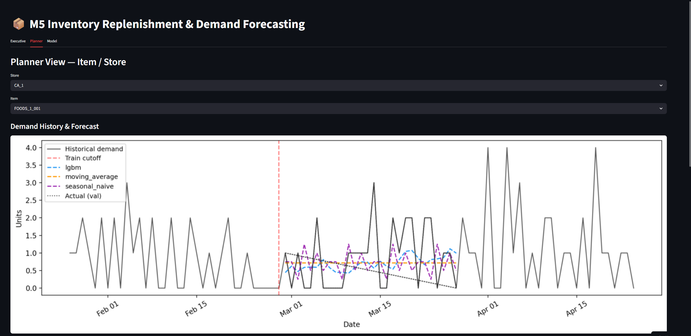
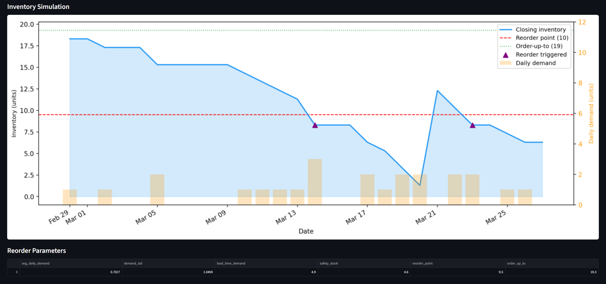

# M5 Inventory Replenishment & Demand Forecasting

A portfolio-grade supply chain project built on the [M5 Forecasting Accuracy](https://www.kaggle.com/competitions/m5-forecasting-accuracy) dataset.

## Dashboard









## What it does

| Layer | Module | Output |
|-------|--------|--------|
| 1. Ingest | `src/ingest/ingest.py` | Cleaned parquet files in `data/interim/` |
| 2. Transform | `src/transform/reshape.py` | `fact_sales_daily.parquet`, `dim_calendar.parquet` |
| 3. Features | `src/features/feature_engineering.py` | `fact_features.parquet` with lag, rolling, price, calendar features |
| 4. Baselines | `src/forecasting/baseline_models.py` | Moving average + seasonal naive 28-day forecasts |
| 5. LightGBM | `src/forecasting/lgbm_model.py` | Gradient boosting forecast + feature importances |
| 6. Replenishment | `src/replenishment/replenishment_engine.py` | Reorder points, safety stock, inventory simulation |
| 7. Evaluation | `src/evaluation/evaluate.py` | RMSE/MAE/MAPE tables, stockout/overstock KPIs, charts |
| 8. Dashboard | `src/dashboard/app.py` | Streamlit app with Executive, Planner, and Model views |

## Setup

### 1. Install dependencies

```bash
pip install -r requirements.txt
```

### 2. Download the M5 dataset

Download from Kaggle: https://www.kaggle.com/competitions/m5-forecasting-accuracy/data

Place these files in `data/raw/`:
- `calendar.csv`
- `sales_train_validation.csv`
- `sell_prices.csv`

### 3. Configure pilot scope (optional)

Edit `config/settings.yaml` to run on a single store first:

```yaml
data:
  pilot_store: CA_1        # or set to null for all stores
  pilot_category: null     # or filter to FOODS, HOBBIES, HOUSEHOLD
```

### 4. Run the pipeline

```bash
# Full pipeline
python run_pipeline.py

# Fast baseline-only run (no LightGBM)
python run_pipeline.py --skip-lgbm

# Specific steps only
python run_pipeline.py --steps 1,2,3
```

### 5. Launch the dashboard

```bash
streamlit run src/dashboard/app.py
```

## Project structure

```
forecasting/
├── config/
│   └── settings.yaml          # All configurable parameters
├── data/
│   ├── raw/                   # Source M5 CSV files (not committed)
│   ├── interim/               # Cleaned parquet after ingestion
│   └── processed/             # Feature tables, forecasts, simulations
├── outputs/
│   ├── tables/                # CSV metrics tables
│   ├── charts/                # PNG forecast + inventory charts
│   └── models/                # Saved model artifacts (lgbm_model.pkl)
├── src/
│   ├── ingest/ingest.py
│   ├── transform/reshape.py
│   ├── features/feature_engineering.py
│   ├── forecasting/
│   │   ├── baseline_models.py
│   │   └── lgbm_model.py
│   ├── replenishment/replenishment_engine.py
│   ├── evaluation/evaluate.py
│   └── dashboard/app.py
├── tests/
├── run_pipeline.py
└── requirements.txt
```

## Key design decisions

- **Pilot scope first**: default config uses CA_1 store only. Set `pilot_store: null` to scale.
- **Leakage-safe features**: all lag and rolling features use `shift(1)` before the window — no same-day leakage.
- **Time-based splits only**: validation window is carved from the tail of history; no shuffling.
- **Fixed lead time + order-up-to policy**: configurable in `settings.yaml`. Safety stock uses z × σ × √L formula.
- **Parquet throughout**: fast columnar storage; no database required.

## Replenishment logic

```
safety_stock   = z * demand_std * sqrt(lead_time_days)
reorder_point  = lead_time_demand + safety_stock
order_up_to    = reorder_point + target_days_coverage * avg_daily_demand
```

A reorder is triggered on any simulation day where `closing_inventory ≤ reorder_point`.
The order arrives `lead_time_days` later.

## Metrics produced

**Forecast quality**
- RMSE, MAE, MAPE per model
- Breakdown by category and store

**Operational KPIs**
- Service level (% days without stockout)
- Stockout days and overstock days
- Average days of supply
- Total reorder events
- Top 20 items by stockout risk
